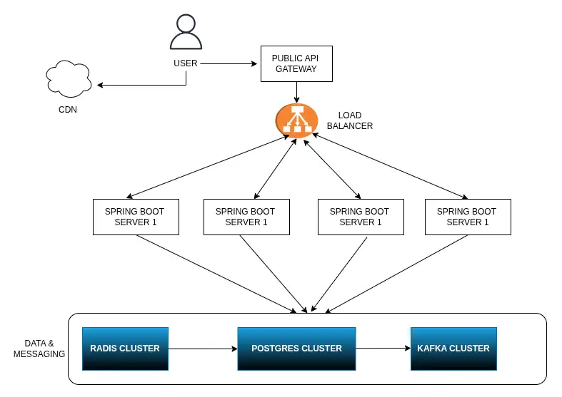
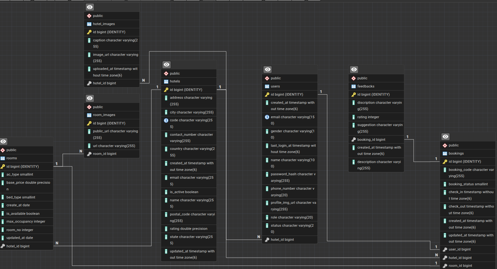

# Hotel Management System (Multi-Branch)

## Overview
A centralized hotel management system that supports multiple branches under one company.
It enables administrators, branch managers, and receptionists to manage rooms, bookings,
check-ins/outs, staff, and payments from a single unified platform.

The system aims to simplify daily hotel operations while providing real-time visibility
of occupancy, revenue, and performance across branches.

## Vision
To build a secure, scalable, and easy-to-use system that unifies management
of all hotel branches under one dashboard.

## Primary Goals
1. Allow the head office to monitor and control all branches.
2. Ensure each branch has its own rooms, staff, and bookings separated logically.
3. Provide customers with smooth online booking and payment experiences.
4. Generate accurate analytics and reports across all branches.
5. Maintain clear role-based access control for security.

## User Roles
- **Super Admin:** Manage branches, view global reports.
- **Branch Manager:** Manage rooms, bookings, and staff of their branch.
- **Receptionist:** Handle daily check-ins/outs and payments.
- **Customer:** Search rooms, book, and pay online.
- **Support Staff:** Update room cleaning and maintenance status.
- **Payment Gateway:** External actor, deals with transactions.

## Version 1 Scope (MVP)
- Multi-branch structure with separate data sets.
- Room CRUD operations per branch.
- Booking flow with date validation and status updates.
- Basic authentication and role management.
- Dashboard showing current bookings and occupancy.

## Motivation
This project is part of my learning journey in backend development.
It will demonstrate how to design, develop, and deploy a production-ready application using
Java, Spring Boot, and PostgreSQL.

-------------------------------------------------------------------------------------------
#--------- Role based actions ----------

##1. Super Admin (Owner / CEO / Chain Owner)

This is the top-level authority — the person (or group) who owns the entire chain.
Responsibilities:

Creates and manages hotel branches.

Assigns a manager to each branch.

Views overall reports (total revenue, occupancy across all branches).

Sets pricing rules or policies that apply to all hotels.

##2. Branch Manager

Each branch (say Hotel in Kolkata, Hotel in Delhi) will have its own manager.
Responsibilities:

Manages staff under that specific branch (receptionists, housekeeping, etc.).

Oversees room availability, rates (within limits).

Approves discounts or cancellations.

Generates reports for that branch only.

##3. Staff / Receptionist

They operate at the ground level of a hotel branch.
Responsibilities:

Handles daily bookings, check-ins, check-outs.

Updates room occupancy.

Manages customer complaints and billing.

##4. Housekeeping Staff

Smaller, specialized role for cleanliness and room maintenance.
Responsibilities:

Marks rooms as “cleaned”, “under maintenance”, etc.

May get automated alerts from reception when a guest checks out.

##5. Customer / Guest

External actor — uses the website or mobile app to find rooms, book, pay, and review.
Responsibilities:

Registers account, searches rooms by location/branch/date.

Makes payments securely.

Views booking history.

##6. System / Payment Gateway (External Actor)

This isn’t a person, but an external service interacting with your system.
Responsibilities:

Processes online payments.

Confirms payment status (success, failure, refund)

# Hierarchy looks like this : ↓

Super Admin (Owner/CEO)
        ↓
  Branch Managers
        ↓
Receptionists / Staff
        ↓
 Housekeeping
        ↓
   Customers
   
   
## ---- Functional Requirements (What the system does) ---- 

Short bullet form is fine.

Multi-branch management (each hotel branch works independently under one manager).

Customer registration, login, and booking.

Room availability, check-in/out operations.

Payment integration and invoice generation.

Admin and manager dashboards for reports.

Role-based access control.

## ---- Non-Functional Requirements (System qualities) ----

Describe expectations.

Performance: Pages load under 2 seconds.

Security: JWT authentication, encrypted passwords, HTTPS.

Scalability: Supports adding new branches easily.

Reliability: Daily backups, error logging.

Maintainability: Modular design with clear APIs.

## ---- MVP Scope (using MoSCoW) ----

Must Have: Multi-branch structure, login system, room booking, payment, basic reports.

Should Have: Admin dashboard, branch-wise analytics.

Could Have: Email/SMS alerts, coupons.

Won’t Have (for now): AI pricing suggestions, multi-currency support.

## ---- 6. Future Considerations ----

Integration with IoT room sensors.

Mobile app interface.

API gateway for third-party travel websites.

## ---- Component Architecture ----

+------------------------+         +----------------------+         +-------------------+
|   Client (React)       | <-----> |   Backend API        | <-----> |   PostgreSQL DB   |
|  - Customer UI         |  HTTPS  |  Spring Boot         |   JPA   |  - branches,rooms |
|  - Admin / Staff UI    |         |  - Auth (JWT)        |         |  - bookings,users |
+------------------------+         |  - BookingService    |         +-------------------+
                                   |  - PaymentService    |                   ^
                                   |  - ReportingService  |                   |
                                   +----------------------+                   |
                                            |   ^                             |
                                            |   | (async/webhook)             |
                                    +----------------------+    +------------+-----------+
                                    |  External Systems     |    |  Object Storage (S3)  |
                                    |  - Payment Gateway    |    |  - invoices/receipts  |
                                    |  - Email/SMS provider |    +------------------------+
                                    +----------------------+

 

